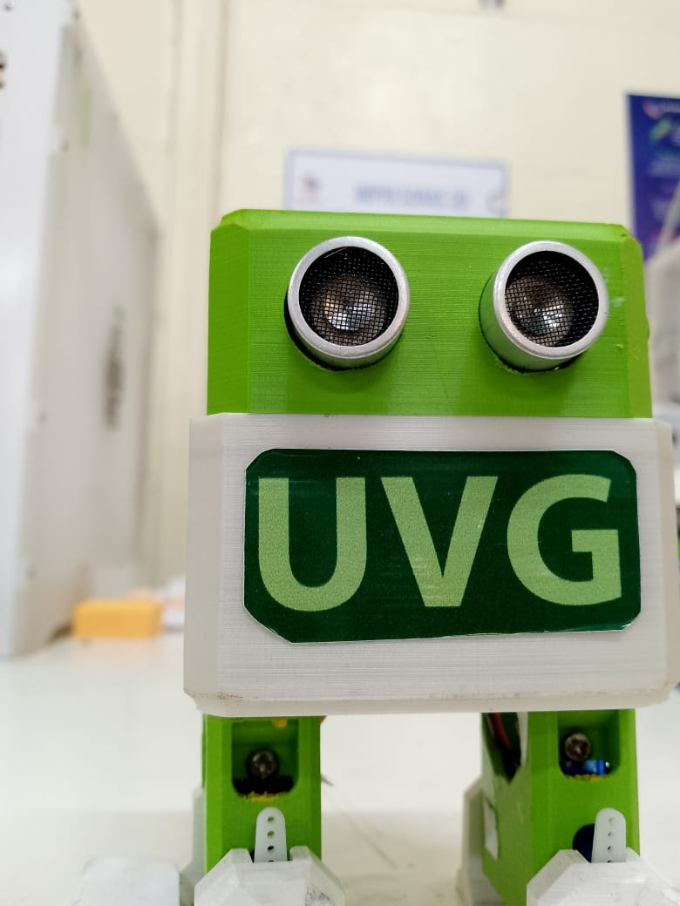

# robotOtto
configuration and use robot Otto

## Moviemientos

<video src="videofile.ogg" autoplay poster="posterimage.jpg" width="320" height="240" controls>
  <source src="./otto_video.mp4" type="video/mp4">
</video>

<video width="320" height="240" controls>
  <source src="otto_video.mp4" type="video/mp4">
</video>
